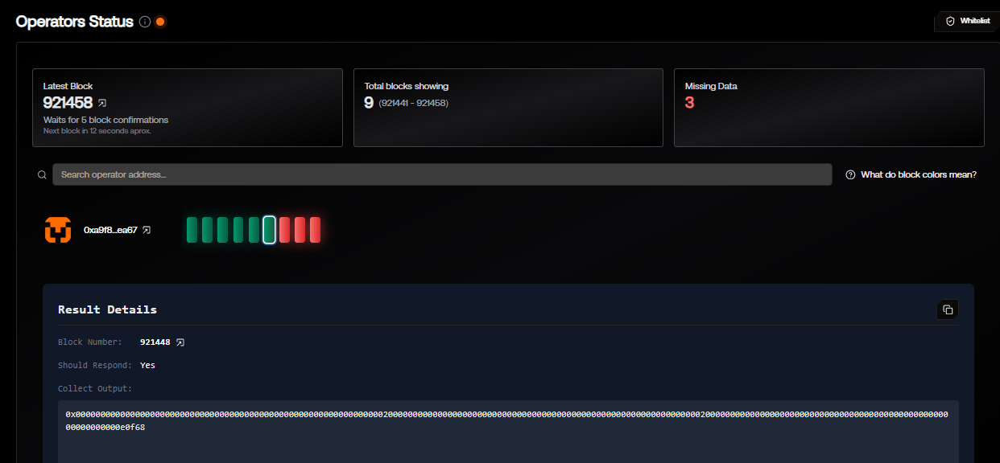
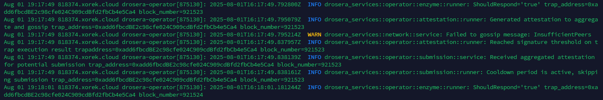

# Drosera Trap Example

This repository contains a working example of a custom trap deployed and successfully triggered in the **Drosera test network** using the `ethereum-hoodi-rpc` endpoint.

## ✅ Features

- Custom Solidity trap contract that emits a log when a new block is detected.
- Drosera operator configured and successfully tested.
- Logs and dashboard screenshots included as evidence.

## 📂 Contents

- `src/`: Solidity source code of the trap.
- `images/`: Screenshots of Drosera dashboard and terminal logs.
- `README.md`: This file.

## 🚀 Deployment Summary

- Chain ID: `560048`
- RPC: `https://ethereum-hoodi-rpc.publicnode.com`
- Drosera RPC: `https://relay.hoodi.drosera.io`
- Trap Address: `0xadd6fbcdBE2c98cfe024C909cdBfd2fbCb4e5Ca4`

## 🖼 Screenshots

### Operator Dashboard

### Execution Logs

